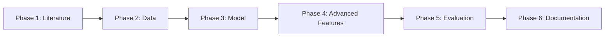

# NEST Automated Pipeline

This directory contains the automated Copilot-driven development pipeline configuration.

## Directory Structure

```
.github/
├── copilot-workspace/          # Phase-specific Copilot instructions
│   ├── phase-1-literature-review.md
│   ├── phase-2-data-preprocessing.md
│   ├── phase-3-model-architecture.md
│   ├── phase-4-cross-lingual.md
│   ├── phase-5-evaluation-optimization.md
│   └── phase-6-documentation-dissemination.md
├── workflows/                  # GitHub Actions workflows
│   ├── phase-execution.yml     # Main phase execution workflow
│   ├── auto-review-merge.yml   # Automated review and merge
│   ├── phase-trigger.yml       # Sequential phase triggering
│   └── quality-checks.yml      # Code quality validation
├── PULL_REQUEST_TEMPLATE/      # PR templates
│   └── phase_template.md
├── copilot-instructions.md     # General Copilot instructions
└── PIPELINE.md                 # Pipeline documentation
```

## Quick Start

### Start Phase 1
```bash
gh workflow run phase-execution.yml -f phase=1
```

### Monitor Progress
```bash
# List all phase PRs
gh pr list --label automated

# View workflow runs
gh run list --workflow=phase-execution.yml
```

## How It Works

1. **Trigger**: Start a phase workflow (manual or automatic)
2. **Branch**: Workflow creates a dedicated branch
3. **PR**: Creates a PR with phase instructions
4. **Implement**: Copilot Workspace implements the phase
5. **Review**: Auto-review by Copilot
6. **Quality**: Automated quality checks
7. **Merge**: Auto-merge when approved
8. **Next**: Automatically triggers next phase

## Phase Sequence



## Documentation

See [PIPELINE.md](PIPELINE.md) for complete documentation.

## Configuration Files

- **Copilot Workspace**: Instructions for each phase implementation
- **Workflows**: Automation orchestration
- **Quality Checks**: Linting, testing, documentation validation

## Support

For issues with the automated pipeline:
1. Check workflow logs in Actions tab
2. Review [PIPELINE.md](PIPELINE.md) troubleshooting section
3. Open an issue with the `pipeline` label
