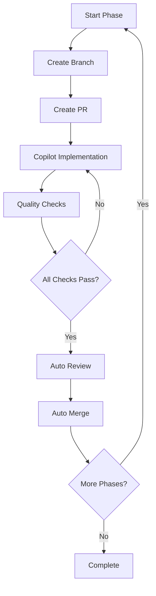

# NEST Automated Pipeline Setup

## 🎯 Quick Start

The NEST project uses an **automated Copilot-driven pipeline** where each development phase is handled by GitHub Copilot Workspace with auto-review and auto-merge capabilities.

### Prerequisites

1. **GitHub CLI** installed and authenticated:
   ```bash
   # Install GitHub CLI
   brew install gh  # macOS
   
   # Authenticate
   gh auth login
   ```

2. **Enable GitHub Copilot Workspace** for your repository

### Starting the Pipeline

#### Option 1: Using the starter script (Recommended)
```bash
chmod +x start-pipeline.sh
./start-pipeline.sh 1  # Start Phase 1
```

#### Option 2: Manual trigger
```bash
gh workflow run phase-execution.yml -f phase=1
```

### What Happens Next?

1. ✅ Workflow creates a branch: `phase-1-literature-review`
2. ✅ Creates a PR with phase instructions
3. ✅ GitHub Copilot Workspace implements the phase
4. ✅ Auto-review by Copilot
5. ✅ Quality checks run automatically
6. ✅ Auto-merge when approved
7. ✅ Next phase (Phase 3) triggers automatically

### Monitoring Progress

```bash
# View active PRs
gh pr list --label automated

# Check workflow status
gh run list --workflow=phase-execution.yml

# Open in browser
gh repo view --web
```

## 📋 Phase Overview

### Phase 1: Literature Review & Foundation
- Comprehensive survey of sequence transducers
- EEG-to-text decoding analysis
- Attention mechanisms review
- Silent Speech Interface research
- Benchmarks and evaluation metrics

### Phase 2: Data Acquisition & Preprocessing
- ZuCo dataset loading
- Signal preprocessing
- Artifact removal
- Data augmentation

### Phase 3: Model Architecture Development
- CNN spatial encoder
- Temporal encoders
- Attention mechanisms
- Sequence transducer

### Phase 4: Advanced Model Features & Robustness
- Advanced attention mechanisms
- Robust tokenization (BPE/SentencePiece)
- Subject-independent generalization
- Pre-trained LM integration

### Phase 5: Evaluation & Optimization
- Performance benchmarking
- Model compression
- Edge deployment

### Phase 6: Documentation & Dissemination
- Research paper
- Open-source release
- Demo application

## 🔧 Pipeline Configuration

All pipeline configurations are in `.github/`:

- **Copilot Workspace configs**: `.github/copilot-workspace/`
- **GitHub Actions workflows**: `.github/workflows/`
- **Full documentation**: `.github/PIPELINE.md`

## 🛠️ Manual Intervention

If you need to manually review or edit:

```bash
# Checkout the phase branch
git fetch origin
git checkout phase-X-name

# Make changes
git add .
git commit -m "Manual adjustments"
git push

# The PR will update automatically
```

## 📊 Quality Gates

Each phase must pass:
- ✅ Code linting (flake8, black, isort)
- ✅ Unit tests
- ✅ Documentation completeness
- ✅ Copilot review approval

## 🤖 Full Automation Flow



## 📚 Documentation

- [Pipeline Details](.github/PIPELINE.md) - Complete pipeline documentation
- [Roadmap](ROADMAP.md) - Project roadmap
- [Literature Review](docs/literature-review/) - Phase 1 deliverables

## 🎉 Let's Get Started!

Ready to begin Phase 1?

```bash
./start-pipeline.sh 1
```

The entire pipeline will run automatically from Phase 1 through Phase 6! 🚀
